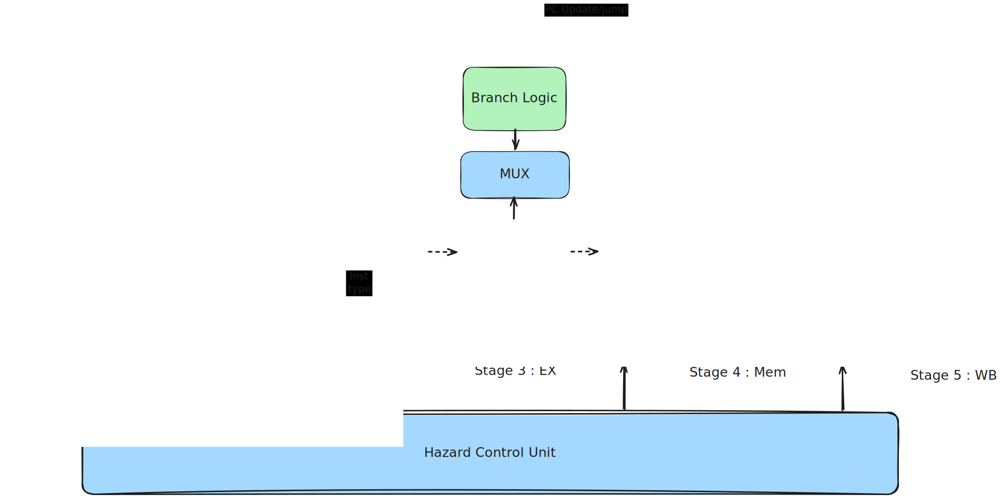

<center>

# RippleV : Pipelined RISC-V (RV32IMZicsr) Core

</center>

RippleV is a RISC-V core, supporting 32 bits *I*, *M* & *Zicsr* extensions, based on *Harvard* architecture.

## Design

### Supported Instruction

| Type                  | Instructions                                                      |
|  :----:               |  :----:                                                           |
| I-type                |  ADDI, SLTI, SLTIU, ANDI, ORI, XORI, SLLI, SRLI, SRAI, LUI, AUIPC |
| R-type                |  ADD, SUB,SLTU, SLT, AND, OR, XOR,SLL, SRL                        |
| Uncodtional Jump      |  JAL, JALR                                                        |
| Conditional Jump      |  BEQ, BNE, BLT, BLTU                                              |
| Load/Store            |  LW, LH, LHU, LB,LBU, SW, SH, SB                                  |
| System                |  ECALL, EBREAK, FENCE                                             |
| M-Extension           |  MUL, MULH, MULHU, MULHSU, DIV, DIVU, REM, REMU                   |
| Zicsr                 |  CSRRW, CSRRS, CSRRC, CSRRWI, CSRRSI, CSRRCI                      |
| *Priviledged*         |  MRET, WFI                                                        |

### Supported CSRs

        1) stvec        2) satp        3) mhartid       4) mstatus      
        5) medeleg      6) mideleg     7) mie           8) mtvec   
        9) mepc         10) mcause     11) mnstatus     12) pmpcfg0     13) pmpaddr0

### Default Handler Addresses

| Type          | Address       |
|  :----:       |  :----:       |
| Reset         |  0x0          |
| Exception     |  0x4          |
| Interrupt     |  0x8          |

### Design Decisions
- FENCE instruction in implemented as a NoP
- Interrupt can only be asserted via interrupt bit of *mstatus* CSR.

### Core Diagram
<center> 

 
        
        Fig 1 : Multi-cycle RippleV Core.
</center>

<center> 

 
        
        Fig 2 : Pipelined RippleV Core.
</center>

**Legend**:
- Yellow = Temporary design.
- Blue (for pipelined) = Same design for multi-cycle and pipelined.
- Red (for pipelined) = Pipeline register
- Green (for pipelined) = New Design

**Note**: Diagrams shown above are not final, does not include control paths and are only for general understanding. Actual implementation might differ from  what is shown, however the aim would be to match the implementation to the diagrams as closely as possible. Hence, both the diagrams and implementation might be updated from time to time. 

## Result

### Clock-latency Comparison

| Tests                 | Multi-cycle   | Pipeline      |
|  :----:               |  :----:       | :----:        | 
| riscv-tests: ADDI     |    1759       |    xxxx       |
| riscv-tests: ADD      |    3182       |    xxxx       |       
| riscv-tests: JAL      |    0618       |    xxxx       |
| riscv-tests: JALR     |    0981       |    xxxx       |
| riscv-tests: BEQ      |    2156       |    xxxx       |
| riscv-tests: LW       |    1853       |    xxxx       |
| riscv-tests: SW       |    3133       |    xxxx       |
| custom-SW: factorial  |    0625       |    xxxx       |


## Verification 

### Custom Software Verification (C Program)

#### Pre-requisites

- Simulator & compilers mentioned under [Supported/Recommended Tool](#Supported/Recommened-Tool)
- [RISC-V GNU toolchain](https://github.com/riscv-collab/riscv-gnu-toolchain), with *Prefix = riscv32-unknown-elf*
- Python 3.13 =<
  
#### Steps
- Save your C code as *[sw/sw_tc/](sw/sw_tc/)tc_<test_name>*.c .
- DON'T OMIT **tc_** prefix in the file name.  Include *handler.c* file as header, generic template for C-program is given in [*sw/sw_tc/tc_first.c*](sw/sw_tc/tc_first.c) .
- Run the below command from home directory:        
 ```bash
# Omit "tc_" and ".c" here
make tc_gen TC="<test_name>" 
```
- A new directory would be created at *data/tc_<test_name>*, containing *.elf*, *.hex* and *.dump* files.
- Execute the generated *.hex* file with :
```bash
# Omit "tc_" and ".c" here
# RVMC_PYTEST_FLAG can be used to pass legal pytest flags
make rvmc TC="<test_name>" RVMC_PYTEST_FLAG=
```

#### NOTE

- For the test to pass, one of the *SUCCESS* values is to be written at its corresponding *to_host* address. 

| TO HOST ADDRESS       | SUCCESS VALUE |
|  :----:               |  :----:       |
| 0x01FC                |  0xCAFECAFE   |
| 0x0                   |  0x01         |
| 0x40                  |  0x01         |

### Coverage
see [here](test/README.md)

## Supported/Recommended Tools
- CocoTB (for verification)
- [Verilator](https://github.com/verilator/verilator) v5.048 (simulation/compilation) -- *Recommended*
- Icarus (for simulation/compilation) -- *Support deprecated since [v0.0.1](https://github.com/thatdanish/RippleV/releases)*
- [Surfer](https://gitlab.com/surfer-project/surfer) ( for waveforms) -- *Recommended*
- GTKwave (for waveforms)
  
### Setup

Setup hints for dependencies needed for this repo is given below, run below command and hope nothing breaks :)

```bash
sudo apt-get update

# Install python packages
pip install -r requirements.txt

# Install Verilator dependencies
 sudo apt-get install -y --no-install-recommends \
            git help2man perl make autoconf \
            g++ flex bison libfl2 libfl-dev zlib1g zlib1g-dev

# Install Verilator - build from source and add it to path

# [OPTIONAL] Install Icarus - build from source and add it to path

# Install surfer from source 

# [OPTIONAL] Install GTKwave
sudo apt-get install gtkwave

# Install riscv-gnu-toolchain dependencies (Ubuntu/Wsl)
sudo apt-get install autoconf automake autotools-dev curl python3 python3-pip python3-tomli libmpc-dev libmpfr-dev libgmp-dev gawk build-essential bison flex texinfo gperf libtool patchutils bc zlib1g-dev libexpat-dev ninja-build git cmake libglib2.0-dev libslirp-dev libncurses-dev

# Install riscv-gnu-toolchain from source 

# Install riscv-tests from source
```

## Source

- [Unpriviledged Instructructions](https://docs.riscv.org/reference/isa/_attachments/riscv-unprivileged.pdf)
- [Priviledged Instructions](https://docs.riscv.org/reference/isa/_attachments/riscv-privileged.pdf)
